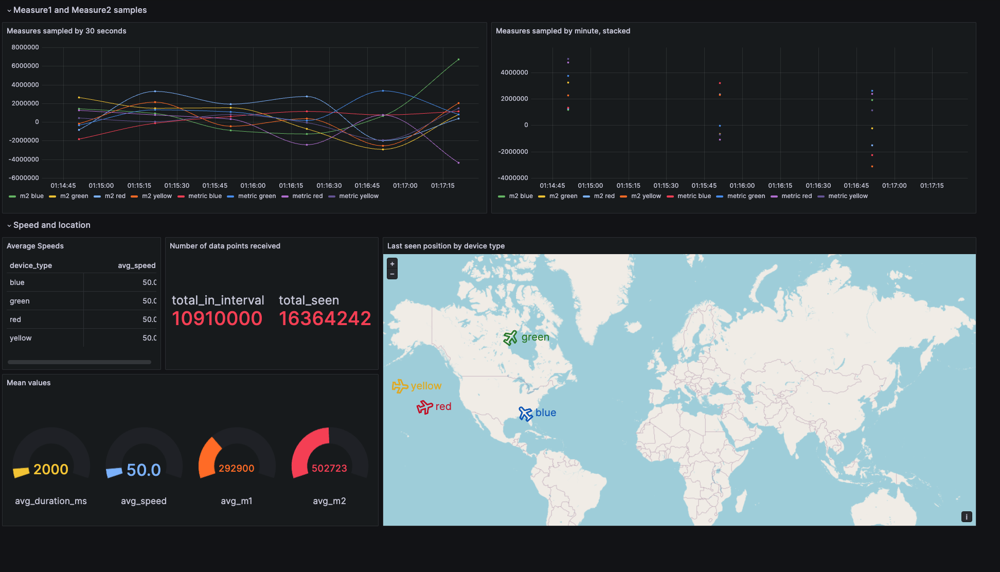

# Time Series Streaming Analytics Template

This repository can be used as a template for near real-time analytics using open source technologies.

It will collect public events from the GitHub API, send them to a message broker (Apache Kafka), persist them into a fast time-series database ([QuestDB](https://questdb.io)), and visualize them on a dashboard (Grafana). It also provides a web-based development environment (Jupyter Notebook) for data science and machine learning, and monitoring metrics are captured by a server agent (telegraf) and stored into the time-series database (QuestDB).


All the components can be started with a single `docker-compose` command, or can be deployed independently.

_Note_: All the components use the bare minimum configuration needed to run this template. Make sure you double check the configuration and adjust accordingly if you are planning to run this in production.

## Pre-requisites

In order to run the ingestion scripts, you need a Github Token. I recommend using a [personal token](https://docs.github.com/en/authentication/keeping-your-account-and-data-secure/managing-your-personal-access-tokens) with read access to public repositories only.

Once you have the token, you can set is as an environment variable and it will be picked up by all the scripts (and by docker-compose for the Jupyter Notebook environment)

`export GITHUB_TOKEN=<YOUR_TOKEN>`

An unsafer alternative would be pasting the token directly in the script.

## Starting up via Docker-compose

This is the recommended way to start all the components, as they will have all dependencies and configuration ready. If you prefer to start each component separately, read the [Starting and configuring components individually](#starting-and-configuring-components-individually) section below. We will be going through each component, but you can check later in this document all the [docker volumes and ports](#full-list-of-components-ports-and-volumes) we are configuring.

From the root directory of this repository, execute:

`docker-compose up`

This might take a few moments, as it needs to download several docker images and initialize them. For reference, a cold
start on my laptop over a wired connection it takes between 30 seconds and 1 minute. Subsequent starts should be way
faster. The downloaded images will use about 1Gb on your disk.

After a few moments, you should see the logs stabilize and stop scrolling fast. There will always be some activity, as the stack collects and store some metrics, but those appear only every few seconds. At that point the project is fully available.

If you want to stop the components at any point, you can just `ctrl+c` and you can restart later running `docker-compose up`. For more permanent removal, please do check the
[Stopping all the components](#stopping-all-the-components) section.


## End-to-end ingestion and visualization

In this section we will use the Jupyter Notebook environment to ingest data using Python. To ingest data using NodeJS,
Golang, Rust, or JAVA, please go to the [ingestion](#ingestion) section of this document for details.

Navigate to [http://localhost:8888/notebooks/Send-Github-Events-To-Kafka.ipynb](http://localhost:8888/notebooks/Send-Github-Events-To-Kafka.ipynb).

This notebook will use the GitHub API to collect public events, will send the events to Apache Kafka using a topic named `github_events`, then wait 10 seconds to avoid any API rates. It will
keep sending data until you click stop or exit the notebook.

Before you run the notebook, make sure you had set the `GITHUB_TOKEN` environment variable. Or
you can just paste it where it says `<YOUR_GITHUB_TOKEN>`.

The data you send to Kafka will be passed to QuestDB, where it will be stored into a table named `github_events`. We will explore the database later.

For now, you can navigate to the live dashboard at [http://localhost:3000/d/github-events-questdb/github-events-dashboard?orgId=1&refresh=5s](http://localhost:3000/d/github-events-questdb/github-events-dashboard?orgId=1&refresh=5s). User is `admin` and password `quest`.

You should see how data gets updated. The dashboard auto refreshes every 5 seconds, but data is only collected every 10 seconds, so it will take ~10 seconds to see new results on the charts. For the first few minutes some of the charts might look a bit empty, but after enough data is collected it should look better.

At this point you can see you already have a running system in which you are capturing data and
running it through an end-to-end data analytics platform.

Let's explore a bit more.

## Checking Data on Kafka

[Apache Kafka](https://kafka.apache.org/) provides a unified, high-throughput, low-latency platform for handling real-time data feeds. Data is
organized into `topics` and store reliably for a configured retention period. Consumers can then read data from those
topics immediately, or whenever is more convenient for them.

Kafka uses a binary TCP-based protocol that is optimized for efficiency and allows Kafka to turn a bursty stream of random message writes into linear writes.

There are many open source and commercial tools to add a web interface to Apache Kafka, but Apache Kafka itself doesn't
has any interface other than its API. However, Kafka includes [several command line tools](https://docs.confluent.io/kafka/operations-tools/kafka-tools.html)
we can use to manage our cluster and to query configuration and data.

We can, for example, use the `kafka-topics` tool to list and manage topics. Since we are already running a container with
docker, we can attach to the container and invoke Kafka topics from itself, as in:

`docker exec -ti rta_kafka_broker kafka-topics --list --bootstrap-server localhost:9092`

If you run the Jupyter Notebook `Send-Github-Events-To-Kafka.ipynb`, the output of this command should include a topic
named `github_events`.

We can also consume events from that topic by running:
`docker exec -ti rta_kafka_broker kafka-console-consumer --bootstrap-server localhost:9092 --topic github_events`.

If you didn't stop the Jupyter Notebook, you should see new entries every few seconds. If you stopped it, you can
[open it](http://localhost:8888/notebooks/Send-Github-Events-To-Kafka.ipynb) and run it again. New entries should appear on
your console as it runs.

Notice that even if we are consuming data from this topic, the data is still being ingested into QuestDB. This is one of
the main advantages of Kafka: multiple consumers can read data from any topic without interfering with each other, and
the system keeps track of the latest event each consumer saw, so it would send by default only newer messages. However,
a consumer can choose to replay data from any point in the past, as long as it is within the retention time range for a
given topic. Or you can also choose to have multiple consumers reading data from a topic collaboratively, so each message
is sent only to a single consumer. Not only that, but f you have demanding requirements, you can add several brokers to
your cluster and partition the topics so the workload will be distributed. All of this with very high performance and
configurable redundancy.

Having Apache Kafka as the entry point for your data analytics pipeline gives you a good and reliable way of dealing with
data at any speed and helps you deal with ingestion peaks, decoupling ingestion from your analytical database. Even when
you have a very fast database, as it is the case with QuestDB, that could keep up with the ingestion rate, it might
still be a good idea to have Kafka in front so you can tolerate database restarts in the event of any upgrade, or data
replaying in case of disaster recovery or debugging.


## Checking the connector data on Kafka Connect

Apache Kafka is not a push system, [by design](https://kafka.apache.org/documentation.html#design_pull). That means
that consumers need to poll data at its own pace whenever they are ready to process a new batch of events. While this
is a good idea from an architecture perspective, implementing that in a reliable way on your consumer is not trivial.

Very conveniently, Apache Kafka comes with [Kafka Connect](https://docs.confluent.io/platform/current/connect/index.html),
a tool for scalably and reliably streaming data between Apache Kafka and other data systems.

Kafka connect can run as a standalone process or in distributed mode — for scalability and fault tolerance —, and can
also run conversions and transforms on the fly before sending data to its destination.

You need two things to stream data from Apache Kafka into another system: A connector plugin, in this case the
`kafka-questdb-connector-0.9.jar`, and a configuration file which, at the very least, will define the origin topic(s),
the data format, and the destination system.

As it happens with Apache Kafka, there is no native web interface for Kafka Connect, but it exposes a REST API — by
default on port 8083 — where we can register new configurations for our connections, or check the ones we already have.
If you are curious, you can inspect the `docker-compose.yml` file to see how it registers two different configurations
on startup. But it is probably easier to just open the [Kafka-connect-inspect.ipynb](http://localhost:8888/notebooks/Kafka-connect-inspect.ipynb)
jupyter notebook and execute the cells there, that will connect to the kafka-connect container and output the list of
connector plugins available in the classpath, the registered connectors, and the configuration for each of the two.

You will notice both configurations will output data to the questdb-connector plugin, using two different Kafka topics for
the input data, and two different tables on the QuestDB database for the output. You will also notice data is expected
in JSON format. The full list of parameters available to this connector is
[documented at the QuestDB website](https://questdb.io/docs/third-party-tools/kafka/questdb-kafka/).


## Querying Data on QuestDB

 [QuestDB](https://questdb.io) is fast time-series database for high throughput and fast SQL queries with operational simplicity. It is designed to run performant analytics over billions of rows. Since we are
 working with streaming data, and streaming data tends to have a timestamp and usually requires timely
 analytics, it makes sense to use a time-series database rather than a generic one.

 QuestDB can ingest data in a number of ways: using Kafka Connect, as we are doing in this template, via
 the [QuestDB Client Libraries](https://questdb.io/docs/reference/clients/overview/) for fast ingestion,with any [Postgresql-compatible library](https://questdb.io/docs/develop/insert-data/#postgresql-wire-protocol),  issuing HTTP calls to the [REST API(https://questdb.io/docs/develop/insert-data/#http-rest-api), or simply [uploading CSV files](https://questdb.io/docs/develop/insert-data/#uploading-csv-files).

 Data is stored into tables and queried via SQL. You can issue your SQL statements with any Postgresql driver or with any HTTP client via the REST API.

QuestDB offers a web console for running queries and uploading CSVs at [http://localhost:9000](http://localhost:9000).

If you have been ingesting data with the Jupyter Notebook `Send-Github-Events-To-Kafka.ipynb`, you should see
one table named `github_events`. You will eventually see other tables with monitoring data from QuestDB itself and from the Kafka broker, as we are collecting metrics and ingesting them into QuestDB for [monitoring](#monitoring-metrics).

Other than standard SQL, QuestDB offers [SQL extensions](https://questdb.io/docs/concept/sql-extensions/) for dealing with time-series data. You can for example run this query:

```SQL
SELECT timestamp, repo, COUNT() FROM github_events SAMPLE BY 5m;
```

This query returns the count of events by repository in 5 minute intervals. Intervals can be any arbitrary amount from microseconds to years.

Data on QuestDB is stored in a columnar format, [partitioned by time](https://questdb.io/docs/concept/partitions/), and physically sorted by increasing timestamp. Ingestion and Querying don't block each other, so ingestion performance remains steady even when there is high usage of queries. With a few CPUs, you can sustain ingestions of several millions of rows per second while querying billions of rows.

All of the above makes QuestDB a great candidate for storing your streaming data.

### Querying QuestDB from a Jupyter Notebook

Since QuestDB is compatible with the Postgresql-wire protocol, we can issue queries from any programming language. You can, for example, use Python and the popular `psycopg` library to query data. Let's open the
Jupyter Notebook [http://localhost:8888/notebooks/questdb-connect-and-query.ipynb]([http://localhost:8888/notebooks/questdb-connect-and-query.ipynb) and execute the script in there.

You will notice QuestDB uses the user `admin`, password `quest`, postgresql port `8812`, and dbname `qdb` by default.


## Data Science and Machine Learning with a Jupyter Notebook

Many projects are happy analysing the past, some also want to predict what will happen based on past data. Time-series forecasting is a very frequent ask when doing streaming analytics.

Of course this is not trivial, but fortunately there are some ready-made models or algorithms that you can use as an starting point. This template provides the
Jupyter Notebook [http://localhost:8888/notebooks/Time-Series-Forecasting-ML.ipynb](http://localhost:8888/notebooks/Time-Series-Forecasting-ML.ipynb) to show how
you can train a model with data from from the QuestDB `github_events` table, and use that to run predictions. The notebook shows how to train two different
models: [Prophet](https://github.com/facebook/prophet?tab=readme-ov-file#installation-in-python---pypi-release) and [Linear Regression](https://scikit-learn.org/stable/modules/generated/sklearn.linear_model.LinearRegression.html).

_Note_: This notebook is not a comprehensive work in time-series forecasting, but just a show of what can be achieved. In a real-life scenario you would ideally use a large amount of taining data and you would probably fine-tune the model for your use case. Other popular time-series models like ARIMA might give you better results in certain scenarios. If your dataset is very big, you might also want to try LSTM models that could perform better in some cases.


## Visualizing data with Grafana

Grafana is an observability platform you can use to display business or monitoring dashboards and to generate alerts if
some conditions are met.

Grafana supports a large number of datasources. In our case, you will be using Grafana to connect to QuestDB, and
display business dashboards that get data running SQL queries behind the scenes. The grafana instance in this template
is pre-configured with a database connection using the Postgresql connector to run queries on QuestDB. If you want
to check the details, the Grafana config, connection, and dashboards are available at the [./dashboard/grafana](./dashboard/grafana)
folder in this repository.


If you've been following the previous steps, you have already seen the dashboard at
[http://localhost:3000/d/github-events-questdb/github-events-dashboard?orgId=1&refresh=5s](http://localhost:3000/d/github-events-questdb/github-events-dashboard?orgId=1&refresh=5s). (User is `admin` and password `quest`).


If you click at the three dots on the top right of any of the charts in that dashboard and then you click 'Explore', you will see
the SQL query powering the dashboard. For example, one of the queries in that panel is:

`SELECT timestamp as time, type, count(*) as total FROM github_events sample by 15s;`

If you click on `Edit` rather than `Explore`, you can change the chart type and configuration, but you won't be able to
save the pre-provisioned dashboard as they are protected. You can always click on the `dashboard settings` icon at the
top right of the screen, and then `save as` to have your copy so you can play around.

For details on how to integrate QuestDB and Grafana you can visit the
[QuestDB Third Party Tools](https://questdb.io/docs/third-party-tools/grafana/) docs.

## Ingestion

You have already seen how to send data to Kafka from a [Jupyter Notebook](#end-to-end-ingestion-and-visualization). If
you prefer to send data to Kafka from a stand-alone Python script, or if you want to use other programming languages,
this template provides [several scripts you can use](#ingesting-streaming-data-into-kafka-using-go-java-or-python).

If you prefer to skip sending data to Kafka and prefer to ingest directly into QuestDB, please skip to [the next section](#ingesting-streaming-data-directly-into-questdb)

### Ingesting streaming data into Kafka using Python, NodeJS, Java, Go, or Rust

The scripts will read data from the GitHub public API, and will send to a Kafka topic named `github_events`. New events
will be fetched every 10 seconds to avoid any API rate limits.

All the scripts in this section require the `GITHUB_TOKEN` environment variable.

`export GITHUB_TOKEN=<YOUR_TOKEN>`

#### Python

Open the `./ingestion/python` folder and install the requirements

```
pip install -r requirements.txt
```

Now just execute via

```
python github_events.py
```

#### NodeJS

Open the `./ingestion/nodejs` folder and install the requirements

```
npm install node-rdkafka @octokit/rest
```

Now just execute via

```
node github_events.js
```

#### Java

Open the `./ingestion/java/github_events` folder and build the jar file

```
mvn package
```

Now just execute via

```
java -jar target/github-events-1.0-SNAPSHOT-jar-with-dependencies.jar
```

#### Go

Open the `./ingestion/go/github_events` folder and get the dependencies

```
go get
```

Now just execute via

```
go run .
```

#### Rust

Open the `./ingestion/rust/github_events` folder and execute via

```
cargo run
```

The initial execution will take a few seconds as the project is built. Subsequent executions should start immediately.

### Ingesting streaming data directly into QuestDB





## Monitoring metrics

TODO

- Telegraf, server agent to collect metrics from Kafka and QuestDB and store them in QuestDB for monitoring.


## Full list of components, ports, and volumes

The list of components, together with their mounted volumes and available ports are:

- broker: The Apache Kafka broker
    - volumes: It mounts a volume using the local `./monitoring/kafka-agent` for a needed .jar dependency to enable monitoring
    - port 29092 (reachable only from the other containers) for bootstrap server
    - port 9002 (reachable from the host machine using `localhost:9092`) for bootstrap server
    - port 9101 for JMX metrics
    - port 8778 for the monitoring metrics we collect with Telegraf
    - connects_to: it doesn't initiate any connections, but it gets incoming connections from `kafka-conect`, `jupyter-notebook`, and `telegraf`
- kafka-connect:
    - volumes: It mounts a volume using the local `./kafka-connect-plugins`, needed to enable ingestion into questdb
    - port 8083 for the REST API for the connect service
    - connects to: `broker:29092` and `questdb:9009`
- questdb:
    - volumes: It will mount a volume using the local `./questdb_root` folder. This folder will store all the database files. It is safe to remove the contents of the folder between restarts if you want to wipe the whole database.
    - port 9000 is the REST API and web console, available at http://localhost:9000
    - port 9009 is for sending streaming data via socket
    - port 8812 is the Postgres-wire protocol. You can connect using any postgresql driver with the user: `admin` and password `quest`
    - port 9003 is for healtcheck `http://localhost:9003` and metrics `http://localhost:9003/metrics`
    - connects to: it doesn't initiate any connections, but it gets incoming connections from `kafka-conect`, `jupyter-notebook`, and `telegraf`
- grafana: It will mount two volumes, pointing at the subfolders of `./dashboard/grafana/home_dir/`. These are used for storing the pre-provisioned credentials, connections, and dashboards, and for any new dashboards you create/
    - port 3000 is the Grafana UI.  `http://localhost:3000`. User is `admin` and password `quest`
    - connects to: `questdb:8812` for getting the data to display
- jupyter-notebook: it mounts a volume using the `./notebooks` folder. It contains the
pre-provisioned notebooks and any new notebooks you create.
    - port 8888: web interface for the Jupyter Notebook environment `http://localhost:8888`
    - connects to: The pre-provisioned scripts will connect to `questdb:8812`, `questdb:9009`, and `broker:29092`
- telegraf: it mounts a read only volume using the local folder `./monitoring/telegraf/`. This contains the configuration for metrics collection from Apache Kafka and QuestDB.
    - ports: No ports are opened for telegraf
    - connects to: It will connect to `broker:8778`, `questdb:9003`, and `questdb:9009`


## Stopping all the components

You can stop all the components by running
`docker-compose down`

Alternatively you can also remove the associated docker volumes (the locally mounted directories will keep the data and
configurations)
`docker-compose down -v`

If you want to remove all the components and their associated docker images (they use about 1Gig on your disk), you can run
`docker-compose down -v --rmi all`

Please note this will still keep the data in the locally mounted directories, most notably in the QuestDB and Grafana
folders. You can remove the local data like this
`rm -r questdb/questdb_root/* dashboard/grafana/home_dir/var_lib_grafana/alerting dashboard/grafana/home_dir/var_lib_grafana/grafana.db dashboard/grafana/home_dir/var_lib_grafana/csv`


## Starting and configuring components individually
TODO


